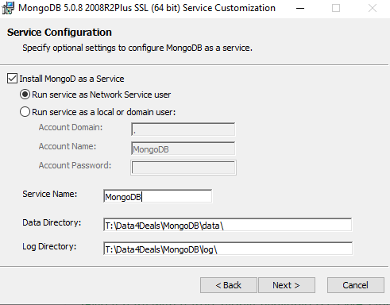
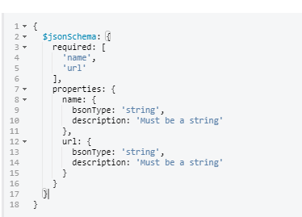
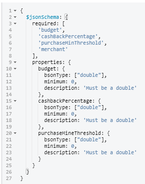

# sprBootSprDataMongoDB
####Short description: This project was made for a test challenge for a recruitment process

###Tech used: 
  *- IntelliJ Ultimate* 
  *- spring initializr* 
  *- maven 3.8.1 (embeded in IntelliJ)* 
  *- spring boot 2.7.0 (& several tools inculuded added with intiiazr)* 
  *- spring data* 
  *- java 8 (open jdk)* 
  *- mongoDB 5.0.8 (windows)* 
  *- Tomcat 9.0.63* 
  *- Git (SourceTree GUI and remote repo hosted on GitHub)* 
  *- Postman*

  

###Setting up MongoDB
  - Download from https://www.mongodb.com/try/download/community
  - Install (custom installation, make sure all server and client features are selected)
  - Keep Service configuration as default for ease of use
    
  - (Optional) Install compass
  - After installation check windows services to see if the service is up
 Notes: use mongoDB old shell or install the new shell to perform DB operations manually (e.g: insert data, show dbs)
  - Create a database named "data4deals"
  - Create a collection named "merchant" and a collection named "Campaign"
  - using compass GUI, add the following validation to merchant collection:
    
  - using compass GUI, add the following validation to campaign collection:
    

###Deployment (manual process)

###Final remarks
Implementation of any currency value should be done with BigDecimal for precision values

